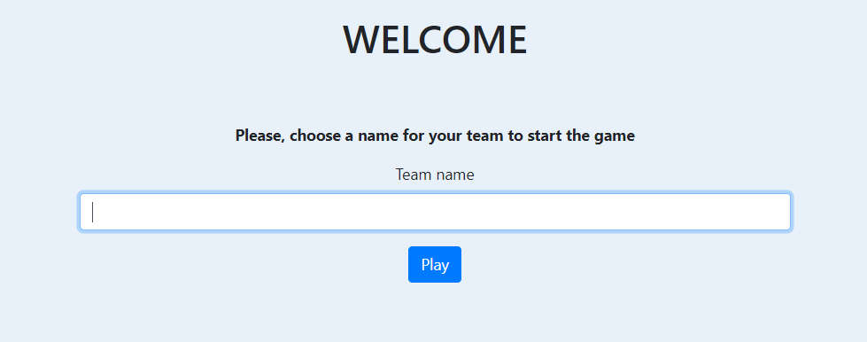
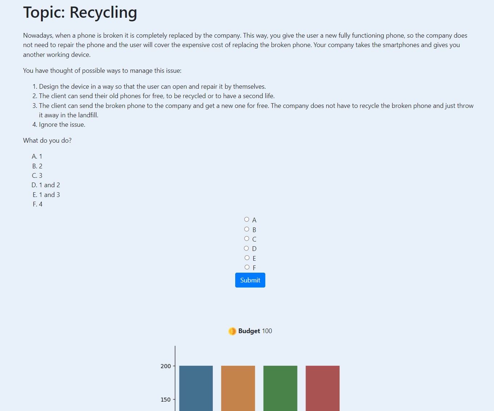
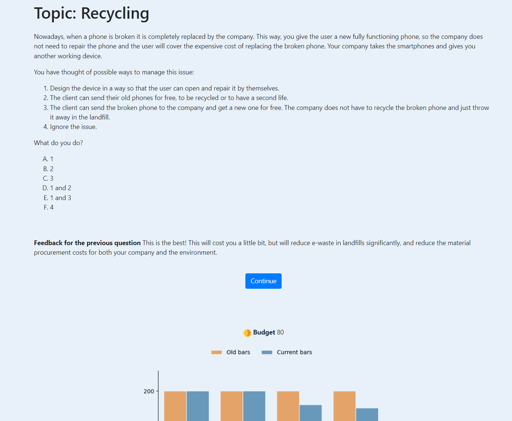

# Project for "How people learn" course at EPFL

### Web-app use

To open the web-app, run <code>app.py</code>, the web-app will then run on localhost. 

To play the game, the user has to choose the name for their team.

After a successful login, a game is started and the first question is displayed.

After a choice is made and before the new question is displayed, the feedback for the previous choice is provided.

